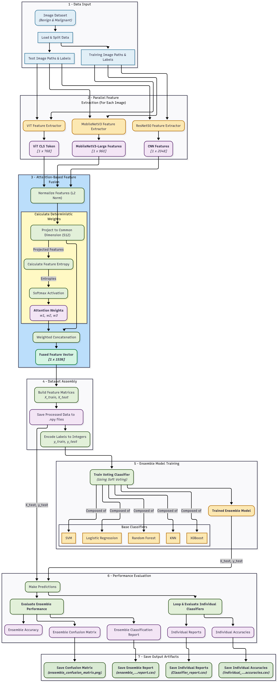

# **A Multi-Modal Entropy-Weighted Fusion Framework for Melanoma Detection**

## **1. Pipeline Flowchart**



---

## **2. Overview**

This repository implements a multi-modal deep-feature fusion pipeline for melanoma classification using dermoscopic images. The system extracts feature embeddings from three pretrained backbones—ResNet-50, MobileNetV3-Large, and ViT-Base—then applies an entropy-weighted attention mechanism to fuse them. The fused vector is classified using a soft-voting ensemble of classical machine-learning models. The method corresponds to the paper *“A Multi-Modal Entropy-Weighted Fusion Framework for Melanoma Detection”*.

---

## **3. Method Summary**

### **3.1 Feature Extraction**

* **ResNet-50** → 2048-D pooled embedding.
* **MobileNetV3-Large** → 960-D pooled embedding.
* **ViT-Base (CLS Token)** → 768-D contextual embedding.
  Each image is preprocessed using the native transforms of the respective pretrained weights.

### **3.2 Entropy-Weighted Fusion**

Implemented in `AttentionFusion`:

1. **L2 Normalization** of each backbone feature.
2. **Projection** to a common 512-D latent space via model-specific FC layers.
3. **Entropy Calculation**: Shannon entropy computed on absolute-normalized activations.
4. **Softmax Weighting**: Higher-entropy modalities receive larger weights.
5. **Weighted Concatenation** → final 1536-D fused feature vector.

### **3.3 Ensemble Classifier**

A soft-voting ensemble incorporating:

* Logistic Regression
* Random Forest
* SVM (RBF)
* KNN
* XGBoost
  All classifiers are trained on the fused feature vectors.

---

## **4. Dataset**

The implementation merges two dermoscopic datasets (Kaggle + ISIC) totaling:

* **12,242 training images**
* **1,660 testing images**
  Classes: *benign* and *malignant*.
  Histogram analysis utilities are included to visualize intensity distributions.

---

## **5. Results**

* **Ensemble accuracy:** ~91.2%
* **AUC:** ~0.97
* **Average Precision:** ~0.97
  Performance surpasses individual classifiers and benefits significantly from multi-modal fusion and entropy-based weighting.

---

## **6. Usage**

1. Ensure GPU environment (Colab recommended).
2. Place dataset under the expected directory structure:

   ```
   dataset/
       train/benign/
       train/malignant/
       test/benign/
       test/malignant/
   ```
3. Run the script/notebook to:

   * extract features,
   * compute fused vectors,
   * train the ensemble,
   * evaluate performance.

---
